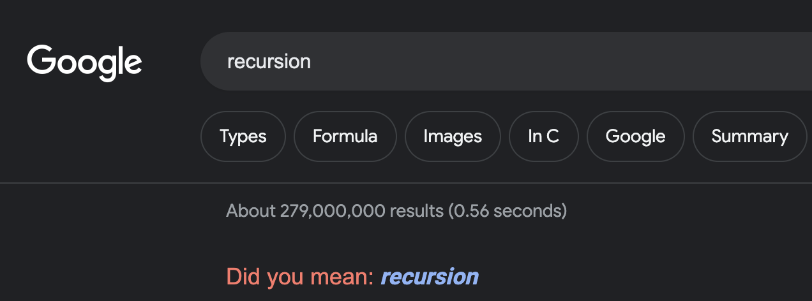

# Recursion Demo


## What Is Recursion

Recursion is a programming technique in which a function calls itself to solve a
smaller instance of the same problem.

It's a powerful technique for solving problems that can be broken down into
smaller, similar subproblems.

The characteristic of a function calling itself leads to some classic jokes.\
For instance, try searching _recursion_ in Google:



## Steps For Solving A Recursive Problem

1. Identify The Base Case
2. Define The Recursive Case
3. Call The Function Recursively
4. Combine Results

### Identify the Base Case

The base case is the simplest scenario in which the problem can be solved
directly without further recursion. It's the stopping point for the recursion.

🚨 Without a proper base case, the recursion can lead to infinite calls.

### Define the Recursive Case

The recursive case involves breaking down the problem into smaller subproblems
that are similar in nature to the original problem. The goal is to reduce the
problem towards the base case by applying a smaller operation.

### Call the Function Recursively

In the recursive case, the function calls itself with modified parameters to
solve the smaller subproblem. This is the key step that drives the problem
towards the base case.

### Combine Results

Once the base case is reached and the recursion starts to unwind, the results
from the smaller subproblems are combined to solve the original problem.

## Running Tests

Start by installing the required dependencies.

```bash
npm install
```

Next, run the tests by invoking the script provided in `package.json`.

```bash
npm run test
```
